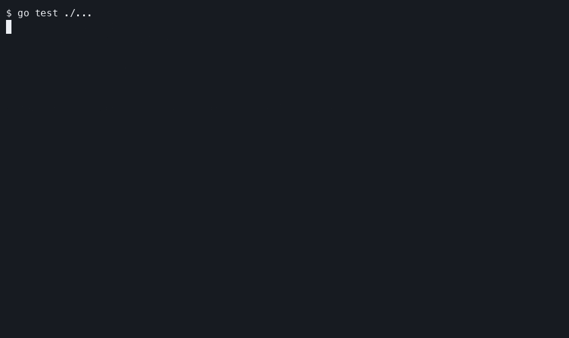

# paw

`paw` is a Go CLI coding-agent harness that productizes a known context-pruning pattern: a small "drone" model compresses raw repository/tool output into a validated digest before a larger "brain" model plans and edits. The drone does not make code decisions. Go validation checks schema shape, paths, line ranges, and verbatim spans before the brain sees the digest.

This project does not claim to invent small-model context compression. See [RELATED_WORK.md](RELATED_WORK.md) and [DESIGN.md](DESIGN.md) for the positioning.

[](docs/DEMO.md)

## Install

With Homebrew:

```sh
brew install gongahkia/paw/paw
```

Quick install:

```sh
curl -sSfL https://raw.githubusercontent.com/gongahkia/paw-cli/main/install.sh | sh
```

From GitHub Releases:

```sh
curl -L https://github.com/gongahkia/paw-cli/releases/latest/download/checksums.txt
```

Download the archive for your OS/architecture from the latest release, verify it against
`checksums.txt`, extract `paw`, and put it on `PATH`.
Each release also publishes SPDX JSON SBOMs as `<artifact>.sbom.json` assets beside the archives.

From source:

```sh
go install github.com/gongahkia/paw@latest
```

From this checkout:

```sh
make build
```

For a release binary, put the `paw` executable on `PATH`.

Default mode uses local Ollama for both models:

```sh
ollama serve
ollama pull gpt-oss:20b
ollama pull qwen3:8b
```

## Quickstart

```sh
paw run --instruction "fix the failing test"
```

First-time setup:

```sh
paw init
paw init --non-interactive --brain-transport ollama --drone-transport ollama
```

Pipeline shape:

```sh
paw run --explain
```

Output:

```txt
gather | compress | plan | edit | verify
```

Resume an interrupted task from its trace:

```sh
paw resume task-abc123
paw resume task-abc123 --trace-file .paw/trace-task-abc123.ndjson
```

Summarize run tokens, turns, wall time, verification, and optional per-1M token costs:

```sh
paw stats task-abc123
paw stats --trace-file .paw/trace-task-abc123.ndjson --rate brain:in=3.0,brain:out=15.0,drone=0.25
```

Rate keys are `brain:in`, `brain:out`, `brain:cache_creation`, `brain:cache_read`, and `drone`.

Watch for inline AI markers and run paw when files are saved:

```sh
paw watch
paw watch --markers "ai:,TODO(ai):"
```

Supported single-line marker comments include `# ai:`, `// ai:`, `/* ai: */`, and `<!-- ai: -->`.
Successful runs remove the marker.

## Exit Codes

| code | meaning |
| ---: | --- |
| `0` | success |
| `1` | system error, including filesystem, network, or model failures |
| `2` | usage error, including bad flags and missing or mutually exclusive required options |
| `64` | agent pipeline completed without a passing verification result |

## Logging

Diagnostics go to stderr. Default logs use text format at `info` level:

```sh
paw run --instruction "fix the failing test"
```

Use JSON logs for aggregators:

```sh
paw run --log-format=json --log-level=debug --instruction "fix the failing test"
```

`--log-format` accepts `text` or `json`. `--log-level` accepts `debug`, `info`, `warn`, or `error`.
Command stdout stays reserved for envelope/output JSON.

## Configuration

Default config path: `$XDG_CONFIG_HOME/paw/config.toml` or `~/.config/paw/config.toml`.
Repo config path: nearest `.paw/config.toml` found by walking from cwd upward, stopping at the git
root, the home directory, or the filesystem root.

Config precedence, later wins:

| order | source |
| ---: | --- |
| 1 | built-in defaults |
| 2 | user config |
| 3 | nearest repo `.paw/config.toml` |
| 4 | explicit `--config` path |
| 5 | `PAW_*` environment variables |

| env var | config field | default |
| --- | --- | --- |
| `PAW_BRAIN_TRANSPORT` | `brain.transport` | `ollama` |
| `PAW_BRAIN_BASE_URL` | `brain.base_url` | `http://localhost:11434` |
| `PAW_BRAIN_API_KEY` | `brain.api_key` | empty |
| `PAW_BRAIN_PROVIDER` | `brain.provider` | empty |
| `PAW_BRAIN_MODEL` | `brain.model` | `gpt-oss:20b` |
| `PAW_DRONE_TRANSPORT` | `drone.transport` | `ollama` |
| `PAW_DRONE_BASE_URL` | `drone.base_url` | `http://localhost:11434` |
| `PAW_DRONE_API_KEY` | `drone.api_key` | empty |
| `PAW_DRONE_PROVIDER` | `drone.provider` | empty |
| `PAW_DRONE_MODEL` | `drone.model` | `qwen3:8b` |
| `PAW_MAX_TURNS` | `max_turns` | `40` |
| `PAW_MAX_BRAIN_TOKENS` | `max_brain_tokens` | `200000` |
| `PAW_CALL_TIMEOUT` | `call_timeout` | brain 120s, drone 60s |
| `PAW_OLLAMA_AUTO_PULL` | `ollama_auto_pull` | `false` |
| `PAW_TLS_CA_FILE` | `tls.ca_file` | empty |
| `PAW_INSECURE_SKIP_TLS_VERIFY` | `tls.insecure_skip_verify` | `false` |
| `PAW_GATHER_MAX_DEPTH` | `gather.max_depth` | stage default |
| `PAW_GATHER_MAX_FILE_BYTES` | `gather.max_file_bytes` | stage default |

Anthropic-compatible brain transport example:

```toml
[brain]
transport = "anthropic"
base_url = "https://api.deepseek.com/anthropic"
api_key = "..."
model = "deepseek-v4-pro"
```

Anthropic requests mark the stable system/tool prefix with ephemeral prompt caching. Cache creation
and read tokens are surfaced in the envelope budget as `brain_cache_creation_tokens` and
`brain_cache_read_tokens`.

OpenAI-compatible API override for benchmark runs:

```sh
export PAW_BRAIN_TRANSPORT=openai
export PAW_BRAIN_BASE_URL=https://api.z.ai/api/paas/v4
export PAW_BRAIN_API_KEY=...
export PAW_BRAIN_MODEL=glm-4.6
```

Local OpenAI-compatible brain profiles do not require an API key when the base URL is loopback.
Use `paw doctor models` after starting the local server.

TLS overrides apply to `openai` and `anthropic` transports. `tls.ca_file` appends a PEM CA bundle
to system roots for private endpoints. `tls.insecure_skip_verify` disables certificate verification
and prints `WARN: TLS verification disabled` on every request.

LM Studio:

```toml
[brain]
transport = "openai"
base_url = "http://localhost:1234/v1"
model = "use-the-loaded-lm-studio-model-id"
```

vLLM:

```toml
[brain]
transport = "openai"
base_url = "http://localhost:8000/v1"
model = "NousResearch/Meta-Llama-3-8B-Instruct"
```

llama.cpp server:

```toml
[brain]
transport = "openai"
base_url = "http://localhost:8080/v1"
model = "gpt-3.5-turbo"
```

Local model sizing on macOS:

| Apple Silicon memory | Suggested setup |
| --- | --- |
| 8-12 GB | Use local drone only; use a subscription/API brain or a 3-4B local brain. |
| 16 GB | Try `qwen3:8b` drone and `gpt-oss:20b` brain; reduce context if memory pressure is high. |
| 24-36 GB | Defaults are the recommended starting point: `qwen3:8b` drone + `gpt-oss:20b` brain. |
| 48 GB+ | Defaults should have more headroom; test larger 30B/32B-class brains only after `paw doctor models` passes. |

These are starting points, not fit guarantees. Context length, quantization, parallel requests, and
other apps change memory use; verify on the target Mac with `paw doctor models`.

Codex CLI brain transport uses the user's existing Codex CLI auth:

```sh
codex login
export PAW_BRAIN_TRANSPORT=codex-cli
export PAW_BRAIN_MODEL=gpt-5
```

Gemini CLI brain transport uses the user's existing Gemini CLI auth:

```sh
gemini
export PAW_BRAIN_TRANSPORT=gemini-cli
export PAW_BRAIN_MODEL=gemini-3-pro
```

Claude CLI brain transport uses the user's existing Claude Code auth:

```sh
claude auth login
export PAW_BRAIN_TRANSPORT=claude-cli
export PAW_BRAIN_MODEL=sonnet
```

OpenCode CLI brain transport uses OpenCode providers, including optional Zen/free models:

```sh
opencode auth login
export PAW_BRAIN_TRANSPORT=opencode-cli
export PAW_BRAIN_MODEL=opencode/big-pickle
```

Aider CLI brain transport uses Aider's configured provider credentials:

```sh
export PAW_BRAIN_TRANSPORT=aider-cli
export PAW_BRAIN_MODEL=openai/gpt-5
```

Goose CLI brain transport can pass both provider and model:

```sh
export PAW_BRAIN_TRANSPORT=goose-cli
export PAW_BRAIN_PROVIDER=ollama
export PAW_BRAIN_MODEL=qwen3:8b
```

Qwen Code CLI brain transport:

```sh
export PAW_BRAIN_TRANSPORT=qwen-cli
export PAW_BRAIN_MODEL=qwen3-coder-plus
```

Cursor CLI brain transport is experimental:

```sh
export PAW_BRAIN_TRANSPORT=cursor-cli
export PAW_BRAIN_MODEL=cursor-default-model
```

Model access comparison:

| transport | local/no-key | subscription CLI | API key required | model listing | schema strength |
| --- | --- | --- | --- | --- | --- |
| `ollama` | yes | no | no | yes | native JSON Schema |
| `openai` loopback | yes | no | no | yes | OpenAI-compatible `json_schema` |
| `openai` remote | no | no | yes | yes | OpenAI-compatible `json_schema` |
| `anthropic` | no | no | yes | yes | tool/schema coercion |
| `codex-cli` | no | yes | CLI-managed | no | native `--output-schema` |
| `gemini-cli` | no | yes | CLI-managed | no | prompt-only |
| `claude-cli` | no | yes | CLI-managed | no | native `--json-schema` |
| `opencode-cli` | provider-dependent | provider-dependent | provider-dependent | yes | prompt-only |
| `aider-cli` | provider-dependent | provider-dependent | provider-dependent | query-only | prompt-only |
| `goose-cli` | provider-dependent | provider-dependent | provider-dependent | no | prompt-only |
| `qwen-cli` | provider-dependent | yes | CLI-managed | no | prompt-only |
| `cursor-cli` | no | yes | CLI-managed | yes | prompt-only, experimental |

## Prior Art

Closest related systems include SWE-Pruner, Focus, TokenPilot, LLMLingua, and The Token Company. `paw` differs by packaging the pattern as a single Go binary with pipeable stages, stock-model drone support, offline-capable defaults, and deterministic validation of quoted spans. paw's measured benchmark results belong in [docs/RESULTS.md](docs/RESULTS.md), not in copied prior-art numbers.

## Docs

- [DESIGN.md](DESIGN.md)
- [RELATED_WORK.md](RELATED_WORK.md)
- [SCHEMAS.md](SCHEMAS.md)
- [MODEL_APIS.md](MODEL_APIS.md)
- [PATCH_FORMAT.md](PATCH_FORMAT.md)
- [BENCHMARKS.md](BENCHMARKS.md)
- [TESTING.md](TESTING.md)
- [SECURITY.md](SECURITY.md)
- [docs/RESULTS.md](docs/RESULTS.md)
