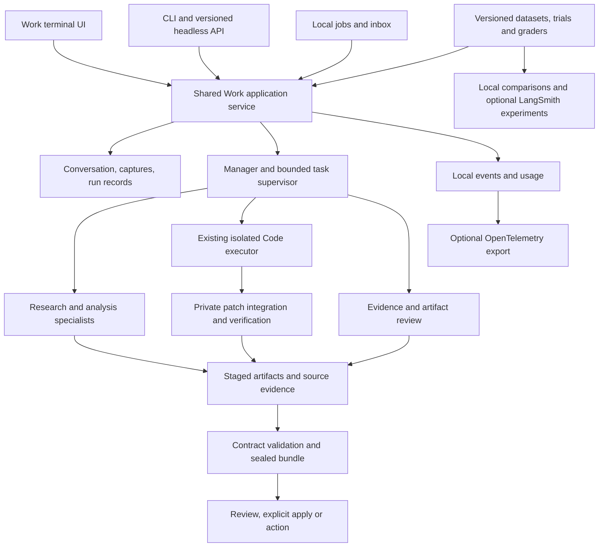

# Gator product depth and engineering assessment

Gator should develop into a provider-independent terminal work environment where a continuing conversation produces reviewable documents, analyses, code changes, and proposed actions. Its strongest differentiator is already present: explicit sources, isolated execution, developer-owned outcome contracts, and retained evidence. The next investment should connect those foundations into complete workflows, deepen the specialist lifecycle, and measure the actual Work product.

The recommended implementation remains native Go. Extend the existing orchestration and evaluation packages; add optional OpenTelemetry export and a LangSmith experiment integration. A wholesale LangChain or LangGraph migration would introduce another runtime and require re-establishing Gator's existing provider, permission, isolation, and evidence behavior. This is an architectural recommendation based on the present code, not a claim that those frameworks cannot be useful.

## Product intention and current foundation

The clearest product specification is [WORK.md](../WORK.md), read alongside [CODE_TO_GATOR_MIGRATION.md](../CODE_TO_GATOR_MIGRATION.md). Gator is intended for people who already work in terminals and need more than code generation: technical operators, researchers, analysts, founders, and developers. A source folder need not be a Git repository. Coding is an internal specialty within the same conversation and deliverable lifecycle.[^1]

The core product loop is objective → selected sources → isolated work → validated deliverables → review → explicit transfer or action. That is a useful product identity. A general chat interface with many tools would lose the value of the source snapshots, contracts, manifests, and review machinery already implemented.

Three concrete workflows should define the next release:

1. Produce a cited decision brief from local documents and explicitly selected connected or web sources; revise it after feedback without losing the conversation or evidence.
2. Reconcile messy tables into a checked workbook and an explanatory memo, with calculations traceable to source rows.
3. Investigate a repository, implement a change through Code specialists, verify the combined result, produce an explanatory document, and revise the code after feedback before explicit application.

Scheduled delivery of these workflows is a fourth product surface. It depends on faithful request execution and recoverable job state, rather than simply adding a background service.

### What is already implemented

| Area | Existing implementation | Product significance |
| --- | --- | --- |
| Provider independence | `internal/model`, protocol adapters, credentials, custom provider configuration | A substantial direct-provider foundation already exists. Do not replace it with a vendor CLI wrapper. |
| Agent execution | `internal/agent` | Normalized messages and tools, streaming extension, transient errors, steering, completion checks, and context handling provide reusable runtime mechanisms. |
| General Work | `internal/workrun`, `internal/workspace` | Non-Git sources, private output, source snapshots, contracts, attachments, connector tools, and specialist dispatch. |
| Deliverables | `internal/artifact` | Text/JSON/CSV and rich document/workbook output, deterministic validation, manifests, export, and explicit artifact transfer. |
| Coding | `internal/run`, `internal/worktree`, `internal/patch`, `internal/sandbox` | Isolated Git execution, instructions, command policy, verification, journaling, patch evidence, and retained legacy delegation machinery. |
| Specialists | `internal/orchestrator`, `internal/workrun/subagents.go` | Fresh-context source researcher, artifact reviewer, and Code specialist; bounded dispatch and parallel batches. |
| Connected work | `internal/connector`, `internal/action`, connector tools | Typed operations, authentication references, read provenance, and exact-action approval boundaries. |
| Work continuity | `internal/worksession`, `internal/snapshot` | Conversation metadata, revision branches, prior artifacts, frozen local inputs. These do not yet constitute complete conversational memory. |
| Automation | `internal/jobs`, `internal/inbox` | Cron/timezone handling, definitions, attempt intent and results, foreground supervisor, inbox, and loopback control. |
| Integration | `internal/rpc`, `internal/acp`, `internal/appserver`, `rpc` | Machine-facing integration around the retained coding engine; not equivalent to a complete Work-native protocol. |
| Evaluation | `internal/eval` | Versioned fixtures, hidden scoring, isolated execution, provenance, repeated attempts, and suite reports around Code. |

The repository's existing orchestration decision already favors a Go manager calling bounded specialists. The useful question is how to make that design durable, observable, and effective, rather than whether to add a supervisor from scratch.[^1]

## Findings that should drive implementation

The first five findings below were reproduced against the audited commit in an isolated temporary copy. The remaining findings distinguish direct source inspection from explicitly labeled implications. The diagnostic patch accompanies this report; its tests assert the current problematic behavior and must be converted into desired-behavior regression tests during implementation.

### 1. Work continuation does not restore the conversation

**Verified by reproduction.** [workrun/executor.go](../../internal/workrun/executor.go) loads a conversation and seeds artifacts from its parent revision, but invokes `agent.Runner` without `InitialMessages`. [worksession/store.go](../../internal/worksession/store.go) retains objective and final text, not the normalized message history needed for replay. A second inspection asking about a codename from the first turn sends only the latest objective to the model.

This means artifact continuity exists while conversational continuity does not. The retained coding runner already has journal-backed message replay and context-handling machinery. Port the relevant behavior into Work with branch-specific history, bounded compaction, attachment references, and explicit handling of opaque provider replay state. Do not concatenate every historical transcript into every specialist prompt.

### 2. An explicit branch can select the wrong snapshot

**Verified by reproduction.** In `workrun/executor.go`, snapshot selection falls back to the conversation's current snapshot before the explicitly requested parent revision is loaded. After refreshing the head's source, a run using an older `ParentRevisionID` inherits the newer source unless another override is supplied.

The selected parent should define the default source, artifacts, and context together. An intentional source refresh or explicit snapshot override needs visible provenance. Back/Forward behavior and explicit parent selection should share the same resolution rules.

### 3. Content deduplication overwrites source attribution

**Verified by reproduction.** [snapshot/snapshot.go](../../internal/snapshot/snapshot.go) derives a snapshot ID from content entries and writes origin metadata to the manifest at that ID. Capturing identical files from two different directories produces the same ID; opening the first capture subsequently reports the second directory as its source.

Deduplicated content and an immutable capture record are different identities. Retain shared content blobs and trees, but give each capture immutable origin, timestamp, inclusion policy, and content-digest references. Historical state needs a versioned compatibility strategy: already overwritten origin metadata cannot be reconstructed reliably from the manifest alone.

### 4. Code configuration is missing from the frozen source path

**Verified exclusion; verified configuration-loading path.** `snapshot.excludedDirectories` excludes `.gator`. [work_code_agent.go](../../cmd/gator/work_code_agent.go) creates Code's private repository from that frozen source. [run/execution.go](../../internal/run/execution.go) loads project profiles, rules, hooks, MCP, LSP, and extensions through the isolated repository/worktree paths. Project configuration omitted upstream cannot be recovered merely by passing a profile name or capability flag.

This conflicts with the migration document's promise that project profiles and trusted integrations remain usable through Work. Scoped `AGENTS.md` files outside `.gator` are a separate case; the finding does not mean all instructions disappear.

**[Inference]** Restoring configuration files alone may still leave trust lookup mismatches because the integration trust methods receive a newly created scratch repository identity. The remedy should be a deliberately captured configuration bundle containing only approved configuration, with its original canonical trust identity and a pinned digest. Keep source data, executable configuration, credentials, and user grants distinct. Do not indiscriminately snapshot `.gator` or implicitly trust a copied directory.

### 5. The Work model wrapper hides optional capabilities

**Verified by reproduction.** [command_work.go](../../cmd/gator/command_work.go) constructs `nativeWorkBackend` by embedding `agent.Model`. The underlying implementation's `StreamingModel` and `VisualInputModel` interfaces are not exposed through that wrapper. A streaming model therefore fails the runner's streaming type assertion in this path; an explicit text-only capability declaration is also lost.

Preserve optional capability behavior through composition, explicit forwarding, or an explicit capability descriptor. Test the assembled Work backend, including unsupported capabilities, rather than only the protocol adapters. Provider-neutrality needs predictable capability behavior, not just a list of provider names.

### 6. The main TUI has a buffered subprocess boundary

**Verified by source inspection.** [work_interactive.go](../../cmd/gator/work_interactive.go) launches `gator work --json`, buffers output, waits for `command.Run()`, and decodes the final response. [worktui/app.go](../../internal/worktui/app.go) receives a final run result through its callback. This path has no live event, steering, cancellation, or approval channel to the running Work operation.

Work requests already expose event and steering hooks, and the old TUI/RPC implementations contain useful control patterns. Introduce a shared application service with typed request, event subscription, cancellation, steering, and approval interfaces. Use it from the CLI and Work TUI. If a subprocess boundary is retained, make it a versioned bidirectional protocol with those semantics; buffered CLI output should not be the application API.

### 7. Specialist execution is a bounded batch helper

**Verified by source inspection.** [orchestrator/orchestrator.go](../../internal/orchestrator/orchestrator.go) validates a dispatch batch, runs children concurrently, waits for the entire batch, then emits retained records. Work configures eight delegations and three concurrent tasks; source/review specialists are capped at eight steps and Code at thirty-two. These bounds are useful, but they are not a durable task supervisor.

Missing product capabilities include inspectable child handles, persisted starts, per-child progress, selective cancellation, continuation, dependency management, retry classification, aggregate usage, and recoverable execution state. The LLM-specialist helper also does not forward the child runner's event stream.

Record lifecycle transitions as they occur. Keep immutable task inputs and independently retained results. A serialized event owner should reconcile concurrent child events before updating manifests, slices, and UI state; simply forwarding concurrent callbacks into the current executor would require a concurrency review. Keep bounded synchronous delegation as a convenient operation over the new lifecycle.

### 8. Coding specialists cannot build on selected prior patches

**Verified by source inspection.** Each Code invocation starts from the original frozen source. The Code request carries no selected patch baseline; outputs are retained as separate `code/subagent-*.patch` files. A later conversation can inherit those files without applying their changes to the next Code specialist's starting tree.

This limits iterative coding and parallel integration. Existing [writer.go](../../internal/run/writer.go) and [writer_batch_scope.go](../../internal/run/writer_batch_scope.go) contain useful mechanisms for baseline identity, write scopes, overlap checks, and patch comparison. Lift appropriate mechanisms to the Work manager's integration boundary while keeping Code children nonrecursive.

Use a private integration workspace based on the source capture plus an explicit selection of accepted patches. Each new child records its exact baseline. Validate individual patches and the combined staged result; retain conflicts and failed verification as evidence. Instruction `Scopes` are not currently a substitute for an enforced writable-path envelope.

### 9. Artifact transfer does not apply code changes

**Verified by source inspection.** [artifact/apply.go](../../internal/artifact/apply.go) transfers artifact files to an explicit target. A `.patch` remains a file to copy; this is not a code-aware patch application workflow.

Add explicit code review/application behavior at the Work product boundary: changed paths, baseline identity, selected patch set, verification results, destination preflight, and conflict handling. Keep ordinary document transfer semantics intact. The child should continue to return staged changes without mutating live source.

### 10. Evals exercise Code, not the main Work product

**Verified by source inspection.** [eval/eval.go](../../internal/eval/eval.go) accepts `gatorrun.Executor`, calls the coding executor, and sets `DisableWriterDelegation: true`. Its existing suite therefore does not exercise the Work manager's delegation, conversations, contracts, connector selection, or final multi-artifact outcomes.

The foundation is valuable: fixture identity, hidden scoring, strict isolation, environment provenance, repeated attempts, suite aggregation, and tests of scorer soundness. Extend it with versioned workflow targets, including direct Code and full Work. Preserve historical reports and fixtures. A trace dashboard alone would leave this product-evaluation gap open.

### 11. Research and data workflows need executable depth

**Verified by source inspection.** Work's default surface combines file operations, artifact writers, connector tools, and delegation. General HTTP/browser tools live in the coding tool surface; Work has no corresponding direct research tool. The source specialist cannot call selected connectors, and its read surface does not expose connected snapshots as a reusable evidence catalog. The source-only promise is also broader than its enforcement: the constructed read surface can read staged and previous output.

[attachment](../../internal/attachment) already extracts supported documents, but files discovered inside a snapshot are not automatically equivalent to explicitly attached documents. Bounded on-demand document extraction, source locators, and deterministic table operations would add more product value than several prompt-only roles. Add a connected/web researcher only with selected-source policy and retained retrieval evidence.

Existing artifact checks establish structural properties such as parseability and package completeness. They do not establish factual support, numerical correctness, or citation coverage. Treat those as separate evaluation and review dimensions.

### 12. Scheduled Work loses request fidelity

**Verified by source inspection.** [command_job.go](../../cmd/gator/command_job.go), `runJobProcess`, reconstructs a CLI request from a stored job. It forwards artifact paths and `contains` checks, but does not preserve the full stored contract, including arbitrary media-type constraints, all validations, and byte limits. `RefreshSnapshot` is not forwarded as a policy; execution starts a new source-based Work run.

The subprocess uses an uncancelled `exec.Command` and a shared, unbounded stdout/stderr buffer. Job records are already more durable than Work's specialist records, so reuse the useful concepts while routing jobs through the same typed application service. Require exact contract and configuration digests at the execution boundary.

**[Inference]** Claiming a schedule slot before durable attempt creation leaves a crash window between advancing the schedule watermark and retaining execution intent. Validate this with fault injection before changing the scheduler. Add reconciliation for interrupted attempts and distinguish retryable reads/computation from externally ambiguous actions.

### 13. Documentation describes different product generations

**Verified by repository inspection.** The root README is absent at the audited commit; history records its deletion. Work migration documentation explicitly defers live control and keeps RPC/ACP as coding compatibility surfaces. Other architecture/parity descriptions still emphasize the older coding experience, and some Work descriptions are ahead of the executable path.

Restore a current entry point and a capability matrix distinguishing implemented, partially connected, deliberately retired, and future behavior. Keep historical code-run records readable. The migration should consolidate the product without silently reinterpreting old protocols or restoring a second Code frontend.

## External research and framework decision

Official product documentation supports the broad manager-and-specialist architecture, but it does not establish identical behavior across products. Configuration, permissions, resumption, and experimental features differ. The comparisons below inform design choices; they are not claims of feature parity or comparative performance.

| Reference | Relevant evidence | Recommendation for Gator |
| --- | --- | --- |
| OpenAI Work/Codex subagents | Official guidance exposes specialized agents, independent context, configuration, and agent navigation.[^2] | Make specialist identity, progress, and role configuration inspectable in the main Work experience. |
| OpenCode | Agents have configurable models and permissions; child-session navigation is part of the documented workflow.[^3] | Add role-specific provider/model selection and transparent effective capabilities. Retain Gator's stricter authority envelope. |
| Claude Code subagents | Custom roles, context choices, foreground/background execution, and main-session handling of child activity are documented.[^4] | Provide selective context, child progress and control, and a clear route for required user interaction. |
| Claude Code agent teams | Teams are documented as experimental, including resumption and coordination limitations.[^5] | Prioritize reliable supervised tasks before peer messaging, nested teams, or autonomous swarms. |
| LangChain | Its subagent pattern uses a central agent calling specialist tools, with explicit context/input/output choices.[^6] | Gator already implements the basic pattern. Adopt useful lifecycle and context concepts without replacing the loop merely for a framework name. |
| LangGraph | Checkpointers provide thread state and completed-task writes that can survive another task's failure.[^7] | Specify checkpoint and recovery semantics explicitly. Reassess framework adoption only if requirements justify a second execution runtime. |
| Google ADK for Go | A Go agent framework exists with model-agnostic design and its own runner/session/tool facilities.[^8] | A native-language alternative exists, but migration would still overlap substantial Gator infrastructure. Require a measured benefit. |
| LangSmith | OTLP tracing and experiment/example association can be integrated independently of the LangChain agent loop.[^9][^10] | Recommended optional hosted integration, behind a local evaluation and telemetry contract. |
| Langfuse | Its native OpenTelemetry ingestion provides another destination for compatible telemetry.[^11] | Keep a vendor-neutral exporter boundary; do not implement two custom dashboards in the first release. |
| OpenTelemetry | GenAI semantic-convention work has moved to a dedicated repository.[^12] | Pin a supported mapping version and keep Gator's durable event schema independent of evolving vendor attributes. |
| Promptfoo | A custom-script provider can invoke an external program for evaluation.[^13] | Optional interoperability adapter after a stable headless Work contract; no mandatory Node orchestration dependency. |
| Harbor | External and installed-agent interfaces support running headless agents in benchmark environments.[^14] | A later coding benchmark adapter, with explicit translation between Gator's retained patches and benchmark workspace outcomes. |

### Recommended stack

Keep `internal/agent`, provider adapters, and existing isolation/evidence domains. Evolve `internal/orchestrator` into a bounded local supervisor. Introduce one shared Work application boundary and a versioned local run/task record. Extend `internal/eval` into the product's local evaluation platform.

Add OpenTelemetry as optional instrumentation. Gator should remain usable without an account, collector, or network connection for its local records and reports. Use an opt-in LangSmith adapter for trace export, dataset/example association, experiment linkage, and evaluation feedback. LangSmith's documented tracing path and its evaluation path are separate integration responsibilities.[^9][^10]

Do not mandate Python, a graph server, Redis, a vector database, or a browser dashboard without a demonstrated requirement. Persistent conversational state and deterministic retrieval over selected sources are immediate needs; cross-project semantic memory is a different feature with a different correctness boundary.

LangGraph becomes a stronger candidate if Gator needs distributed graph workers, durable execution across hosts, or a required graph-specific ecosystem. Before adopting it, prototype one representative workflow and compare packaging complexity, permission fidelity, cancellation behavior, state migration, and quality/cost against the native supervisor. Documentation alone cannot establish which implementation performs better.

## Target architecture and refactoring boundaries

The shared service should resolve requests, configuration, provenance, and lifecycle. `cmd/gator` should parse commands and construct adapters; Bubble Tea should render state and dispatch user actions. Rendering libraries remain in the artifact layer, credentials in their current trusted boundary, and tool execution in existing domain packages.

Do not turn every permission into a generic boolean. Command execution, browser navigation, connector reads, connector mutations, and publishing have different approval and evidence needs. Share lifecycle envelopes and identifiers while preserving domain-specific enforcement. A model may request a task; trusted code decides the effective authority and records it.

A task record should identify its parent run, role/configuration version, selected source and context, dependencies, input contract, allowed tools, budget, timestamps, result references, and error category. Persist queued/running/terminal states before exposing them as durable facts. Keep provider retry attempts distinct from task retries, and keep task attempts distinct from immutable conversation revisions.

Checkpoint recovery must define what can be resumed. Completed pure computations can be reused from retained evidence; a process interrupted mid-command may need a new attempt and verification. An externally ambiguous mutation needs reconciliation and a fresh approval when required by policy. Do not describe arbitrary process or network execution as exactly-once.

Budget accounting should cover the whole tree: manager, children, retries, model calls, elapsed time, and reported token usage. Dollar cost may be unknown for a custom provider; display unknown rather than zero. Enforce available deterministic limits even when token or price metadata is incomplete. Model fallback and role routing must be explicitly configured and recorded.

Context needs separate lifetimes: conversation history, a task's private transcript, selected evidence, compacted summaries, and explicitly trusted reusable instructions. Persist enough private state for valid replay while keeping raw transcripts and credentials out of portable deliverables and default telemetry. Provider-specific replay data needs an explicit policy when changing providers.

For patch integration, maintain immutable baselines and child-local writable roots. Accepted patches move into a private staged baseline through an explicit manager operation. A reviewer observes a frozen candidate version, not a directory another task is still changing. Apply-time checks compare the selected staged changes with the actual target before mutation.

Incremental extraction is preferable to a broad rewrite. First introduce behavior-preserving adapters around existing code; then route one complete workflow through them. Split large CLI/TUI files when the change creates a real ownership boundary. Retain old stores and protocol readers until migrations and compatibility tests are present.

## Evaluation platform specification

The local platform should answer whether a change improves deliverable quality, whether delegation adds value, and what it costs. It should also make individual failures inspectable and reproducible. These are product requirements; uploading spans is only one supporting capability.

Anthropic's agent-evaluation guidance distinguishes task, trial, grader, trajectory, and outcome, and discusses deterministic, model, and human grading. Its emphasis on observed outcomes and repeated trials is relevant here. Gator's proposed design uses those distinctions while preserving its existing hidden-scorer and provenance machinery.[^15]

### Dataset and execution model

Each versioned case should retain an objective, source fixture identity, complete outcome contract, interaction script where applicable, selected connector/browser fixtures, required capabilities, budget, workflow target, and grader version. Keep grading evidence outside the agent-readable input. Record the repository/harness revision, model configuration, effective policy digest, source capture, and trial identity for every attempt.

Support at least direct Code and full Work targets. The latter must traverse the actual manager, supervisor, tool policy, artifact validation, and conversation code. Scripted models are appropriate for deterministic control-flow tests. They are not evidence of live model quality or intelligent delegation.

Start with a curated corpus of approximately 24 tasks: six research/evidence cases, six table/document cases, six coding/integration cases, and six continuation/control/automation cases. This count is a proposed initial scope, not a statistically sufficient benchmark claim. Keep development and held-out tasks separate, and grow the set from observed failures rather than multiplying trivial variants.

| Case family | Examples | Primary checks |
| --- | --- | --- |
| Research and evidence | Conflicting sources, missing evidence, selected connected document, bounded web retrieval | Valid source locators, retained retrieval digest, unsupported-claim disclosure, completeness against a case rubric |
| Tables and documents | Duplicates, schema mismatch, missing values, totals, multi-sheet output | Expected rows/cells, explicit missing-data handling, independently calculated totals, structural artifact checks |
| Coding and integration | Independent edits, overlapping patches, failed verifier, revision of a prior patch | Changed-path envelope, baseline identity, integration result, actual tests, explicit apply conflict |
| Continuation and control | Earlier-turn constraint, explicit old branch, child cancellation, retry, scheduled contract fidelity | Correct replay/source selection, durable lifecycle, bounded work, identical effective contract, no unauthorized action |

Keep deterministic engineering regression tests separate from model-quality experiments. Invalid fixtures, provider outages, sandbox failures, grader errors, and budget exhaustion should not be silently aggregated as ordinary task failures. They still need prominent counts so filtering cannot conceal reliability problems.

### Grading and comparisons

Use deterministic graders for filesystem boundaries, contract integrity, citations resolving to retained evidence, expected table values, patch composition, command outcomes, and forbidden-action attempts. Use a calibrated rubric grader only for qualities such as synthesis or explanation where exact expected output is inappropriate. Store its model/prompt version, evidence, uncertainty, and human calibration labels; the producing agent's self-review is not an independent grade.

A local comparison should report task success counts and denominators, contract pass rate, semantic evidence scores, unsupported claims, integration failures, interventions, latency, retries, model calls, tokens, known cost, and budget exhaustion. Show per-case regressions and source/configuration differences. With repeated trials, report variability and distinguish “at least one succeeds” from “all succeed”; do not present them as interchangeable reliability metrics.

Compare the same tasks and budgets with delegation disabled and enabled. Add per-role ablations once the baseline is trustworthy. More specialist calls should earn their added latency and cost through better results or clearer evidence. Avoid rewarding a particular tool sequence unless that sequence is itself a required policy boundary.

Provide CLI commands or equivalent stable operations for dataset inspection/validation, execution, report viewing, baseline comparison, and export. Local JSON plus readable terminal/HTML reports is a sufficient first platform. A hosted dashboard is optional.

### Observability and release gates

Record parent-child relationships across run, task, model, tool, verification, and artifact-seal activity. Preserve actual provider usage where reported, distinguish estimated values, and bound retention. Default export should exclude document contents, credentials, raw prompts, and private transcripts; content capture needs explicit configuration.

The LangSmith adapter should demonstrate that a case, experiment, trace, and score are associated correctly. Test its mapping and failure handling locally without credentials. A live account is needed to verify the hosted round trip; missing access should be reported rather than represented as completed integration.[^10]

Run deterministic regressions in ordinary CI. Make live evaluation an explicit budgeted command or protected job, with fixed manifests and multiple configured provider families where access exists. Establish a baseline before choosing quality thresholds. Do not invent a universal success percentage or claim comparative model performance from this repository review.

## Delivery sequence and acceptance

| Stage | Coherent deliverable | Acceptance evidence |
| --- | --- | --- |
| 1. Correct Work state | Conversation replay; correct parent/source selection; immutable capture origins; captured trusted configuration; preserved model capabilities | Desired-behavior regressions covering the five reproductions, configuration trust, branch compatibility, and attachment/provider replay |
| 2. Shared live execution | CLI/TUI/jobs use a typed Work service; streaming, cancellation, steering, approval routing; full contract forwarding | Tests of active-run controls, headless framing, cancelled child cleanup, exact job-contract digest, and old protocol compatibility |
| 3. Durable specialists | Inspectable tasks, persisted lifecycle, bounded scheduling, selective context, budgets, role configuration, recovery | Race tests, crash/failure injection, subtree cancellation, budget contention, completed-result recovery, and capability narrowing |
| 4. Complete workflows | Patch baseline/integration and apply review; document/table tools; connected/web evidence; independent claim review | Reproducible fixtures for the three product workflows, follow-up revisions, integrated verification, and target conflict handling |
| 5. Evals and telemetry | Local Work datasets/trials/graders/comparison; usage and optional OTLP/LangSmith integration | Full-Work runs, grader soundness, delegation baseline/ablation, telemetry redaction and mapping; separately reported live checks |
| 6. Product handoff | Recoverable scheduled workflows, Work-centric review/control views, updated docs and compatibility map | End-to-end demos, migration tests, current CLI examples, deterministic CI, recorded limitations and live-eval results |

State and lifecycle work should precede expanding agent count. A new specialist that cannot observe the right evidence or return a durable result adds a role name without adding a dependable workflow. Conversely, an incremental release that demonstrates all three complete workflows creates visible depth even with a small role registry.

Keep cross-device continuation, distributed workers, unrestricted peer agents, a general plugin marketplace, and arbitrary desktop automation outside this release unless the product scope is explicitly changed. Those are separate commitments, not prerequisites for making the current CLI substantially better.

## Scope, verification, and limitations

The audited repository state is `70adf39b57e7bd5469d792e3674ca7f331f5512e` on `main`. Repository status was clean before artifact creation. The assessment covers manifests, Makefile, installer/release/CI configuration, the documentation set, package boundaries, tests, and the principal execution paths across all 50 Go packages. The deepest review follows Work, Code, orchestration, storage, provider assembly, artifact transfer, and evaluations. This is a package-wide architectural and execution-path assessment, not a claim of formal verification or a line-by-line security audit.

Available Git history includes the earlier coding product and its Work migration. The retained Code executor and pre-Work documentation were examined. No separately identified external Gator Code repository was supplied; **I cannot verify this** report against another original repository or unshared branch. The root README's absence is recorded in history rather than assumed accidental.

Verification on Linux used `go1.26.7-X:nodwarf5`; `go.mod` and CI specify Go 1.25.13. No application code was changed for this assessment.

| Command/check | Observed outcome |
| --- | --- |
| `go test -json ./...` | Passed: 50 packages; 1,066 test/subtest pass events, two skips. The count includes subtests. |
| `go vet ./...` | Passed. |
| `go build -o /tmp/gator-audit ./cmd/gator` | Passed. |
| `gofmt -l cmd internal rpc` | No files reported. Read-only formatting check; `make check` was not invoked because its format target writes files. |
| `go test -race ./internal/agent ./internal/orchestrator ./internal/workrun ./internal/worksession ./internal/jobs ./internal/rpc ./internal/appserver` | All seven packages passed. |
| `GATOR_BROWSER_INTEGRATION=1 go test -count=1 -v -run '^TestSidecarManagedBrowserIntegration$' ./internal/browser` | Passed separately, including the pinned managed Chromium path, in approximately 32 seconds. |
| Five temporary `TestAudit...` diagnostics | Passed by reproducing the current gaps; these are diagnostic results, not product fixes. |

The two ordinary-suite skips were the opt-in Chromium test and the macOS Seatbelt boundary test. Chromium was subsequently run and passed. The macOS-only boundary test remains **unavailable on this Linux host**. Exact Go 1.25.13 compatibility and macOS CI were not rerun locally. Live model quality, real connector credentials, and hosted LangSmith/Langfuse ingestion were not tested; **I cannot verify this** report's proposed integrations against live accounts. These omissions do not invalidate the source-level findings, but they limit end-to-end performance and compatibility claims.

The companion [diagnostic patch](product-depth-reproductions.patch) and [verification record](product-depth-verification.txt) preserve the reproduction sources and results. Apply the diagnostic patch only in a disposable checkout of the audited commit. The [implementation prompt](product-depth-prompt.md) translates the recommendations into execution instructions and acceptance criteria.

## Sources

Repository evidence is tied to the commit above. External documentation was accessed on September 9, 2026. Documentation without a stated publication date is identified by access date; mutable pages should be rechecked during implementation.

1. Gator repository. [Work architecture](../WORK.md), [Code-to-Gator product migration](../CODE_TO_GATOR_MIGRATION.md), [Orchestration](../ORCHESTRATION.md), [Evaluation](../EVALUATION.md), and implementation files linked at each finding. Commit `70adf39b57e7bd5469d792e3674ca7f331f5512e`.
2. OpenAI. [Subagents](https://learn.chatgpt.com/docs/agent-configuration/subagents). Official Codex subagents URL redirected to this Work/Codex guide. Accessed September 9, 2026.
3. OpenCode. [Agents](https://opencode.ai/docs/agents/). Accessed September 9, 2026; this source is distinct from the separate v2 documentation path.
4. Anthropic. [Create custom subagents](https://code.claude.com/docs/en/sub-agents). Accessed September 9, 2026.
5. Anthropic. [Orchestrate teams of Claude Code sessions](https://code.claude.com/docs/en/agent-teams). Accessed September 9, 2026.
6. LangChain. [Subagents](https://docs.langchain.com/oss/javascript/langchain/multi-agent/subagents). Accessed September 9, 2026.
7. LangChain. [LangGraph checkpointers](https://docs.langchain.com/oss/python/langgraph/checkpointers). Accessed September 9, 2026.
8. Google. [Agent Development Kit for Go](https://github.com/google/adk-go). Official repository; accessed September 9, 2026.
9. LangChain. [Trace with OpenTelemetry](https://docs.langchain.com/langsmith/trace-with-opentelemetry). Accessed September 9, 2026.
10. LangChain. [How to evaluate with OpenTelemetry](https://docs.langchain.com/langsmith/evaluate-with-opentelemetry). Accessed September 9, 2026.
11. Langfuse. [OpenTelemetry integration](https://langfuse.com/integrations/native/opentelemetry). Accessed September 9, 2026.
12. OpenTelemetry. [GenAI Semantic Conventions](https://github.com/open-telemetry/semantic-conventions-genai). Dedicated repository linked from the current specification page; accessed September 9, 2026.
13. Promptfoo. [Custom script providers](https://www.promptfoo.dev/docs/providers/custom-script/). Accessed September 9, 2026.
14. Harbor. [Agents](https://www.harborframework.com/docs/agents). Accessed September 9, 2026.
15. Anthropic; Mikaela Grace, Jeremy Hadfield, Rodrigo Olivares, and Jiri De Jonghe. [Demystifying evals for AI agents](https://www.anthropic.com/engineering/demystifying-evals-for-ai-agents). January 9, 2026.

[^1]: Gator, [Work architecture](../WORK.md) and [Code-to-Gator product migration](../CODE_TO_GATOR_MIGRATION.md), audited commit above.
[^2]: OpenAI, [Subagents](https://learn.chatgpt.com/docs/agent-configuration/subagents), accessed September 9, 2026.
[^3]: OpenCode, [Agents](https://opencode.ai/docs/agents/), accessed September 9, 2026.
[^4]: Anthropic, [Create custom subagents](https://code.claude.com/docs/en/sub-agents), accessed September 9, 2026.
[^5]: Anthropic, [Agent teams](https://code.claude.com/docs/en/agent-teams), accessed September 9, 2026.
[^6]: LangChain, [Subagents](https://docs.langchain.com/oss/javascript/langchain/multi-agent/subagents), accessed September 9, 2026.
[^7]: LangChain, [LangGraph checkpointers](https://docs.langchain.com/oss/python/langgraph/checkpointers), accessed September 9, 2026.
[^8]: Google, [ADK for Go](https://github.com/google/adk-go), accessed September 9, 2026.
[^9]: LangChain, [Trace with OpenTelemetry](https://docs.langchain.com/langsmith/trace-with-opentelemetry), accessed September 9, 2026.
[^10]: LangChain, [Evaluate with OpenTelemetry](https://docs.langchain.com/langsmith/evaluate-with-opentelemetry), accessed September 9, 2026.
[^11]: Langfuse, [OpenTelemetry integration](https://langfuse.com/integrations/native/opentelemetry), accessed September 9, 2026.
[^12]: OpenTelemetry, [GenAI Semantic Conventions](https://github.com/open-telemetry/semantic-conventions-genai), accessed September 9, 2026.
[^13]: Promptfoo, [Custom script providers](https://www.promptfoo.dev/docs/providers/custom-script/), accessed September 9, 2026.
[^14]: Harbor, [Agents](https://www.harborframework.com/docs/agents), accessed September 9, 2026.
[^15]: Anthropic, [Demystifying evals for AI agents](https://www.anthropic.com/engineering/demystifying-evals-for-ai-agents), January 9, 2026.
